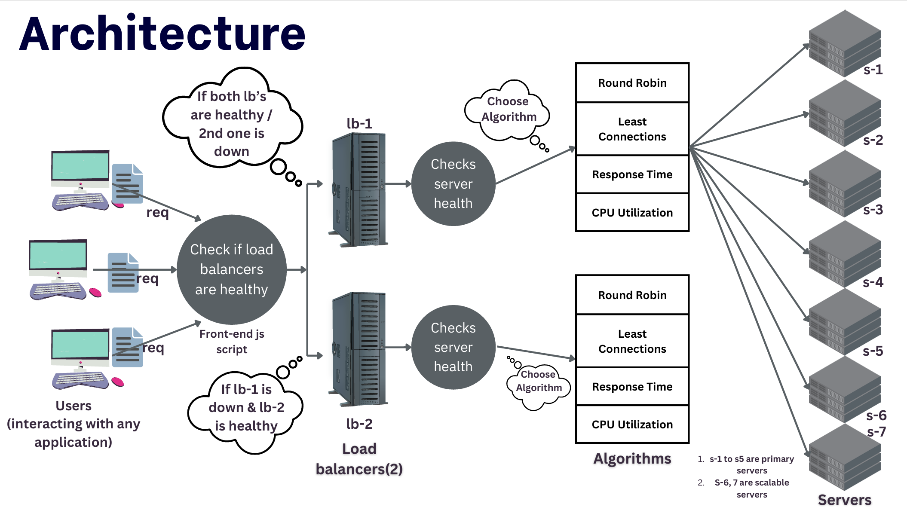

# Dynamic Load Balancer with Horizontal Scaling

This project is a fully featured dynamic load balancer that supports multiple algorithms for distributing requests across backend servers. It incorporates real-time health checks, autoscaling, and performance monitoring. The load balancer dynamically adjusts server usage based on CPU metrics, response times, and connection counts to optimize traffic distribution and ensure high availability.

### *Presentation slides*:
**Please download the below pptx or pdf file to get a better understanding of this project:**
- Download: [pptx format](<Cloud Computing.pptx>)
- Download: [pdf format](<Cloud Computing.pdf>)

## Table of Contents

- [Introduction](#introduction)
- [Features](#features)
- [Architecture](#architecture)
- [Technologies](#technologies)
- [Setup and Installation](#setup-and-installation)
- [Configuration](#configuration)
- [Load Balancing Algorithms](#load-balancing-algorithms)
  - [Round Robin](#round-robin)
  - [Least Connections](#least-connections)
  - [Least Response Time](#least-response-time)
  - [Dynamic Load Balancing](#dynamic-load-balancing)
- [Autoscaling](#autoscaling)
- [Health Monitoring and Metrics](#health-monitoring-and-metrics)
- [APIs](#apis)
  - [Health Check](#health-check)
  - [Send Request](#send-request)
  - [Server Metrics](#server-metrics)
- [Performance Considerations](#performance-considerations)
- [Limitations](#limitations)
- [Contributing](#contributing)
- [License](#license)

## Introduction

This project implements a **dynamic load balancer** designed for distributed systems requiring horizontal scaling. It ensures efficient traffic management by applying different algorithms to route requests to backend servers. The balancer also monitors server health and CPU usage, allowing for autoscaling based on real-time server load.

### Use Cases:
- High-traffic web applications.
- Microservice architectures with distributed backend servers.
- Dynamic scaling of servers in response to varying traffic loads.

## Features

- **Multiple load balancing algorithms**: Round Robin, Least Connections, Least Response Time, and Dynamic load balancing.
- **Autoscaling**: Automatically scales up and down based on CPU usage thresholds.
- **Server health checks**: Continuously monitors backend servers and only routes requests to healthy servers.
- **Real-time performance metrics**: Tracks CPU usage, connection count, and response times of backend servers.
- **Configurable via JSON**: Easily change algorithms and parameters via a `config.json` file.

## Architecture

The load balancer serves as a gateway that receives client requests, selects the appropriate backend server based on the chosen algorithm, and forwards the request. The architecture consists of:

1. **Primary servers**: These servers handle incoming requests by processing them based on the selected algorithm.
2. **Scaling servers**: Additional servers that are used in case of high CPU load on primary servers.
3. **Load balancer**: The main entry point that selects a healthy backend server based on the configured load balancing algorithm.

### Diagram



## Technologies

- **Node.js**: Server runtime.
- **Express.js**: Web framework used to handle requests.
- **Axios**: HTTP client used for communicating with backend servers.
- **JSON**: For configuration management.

## Setup and Installation

### Prerequisites

- **Node.js** v14.x or higher
- **npm** (Node package manager)

### Installation

1. **Clone the repository**:

   ```bash
   git clone https://github.com/ScaleSync/Scale-Sync_Load-Balancer.git
   ```

2. **Install dependencies:**
    ```
    npm install
    ```
By default, the load balancer will be available at http://localhost:4001, http://localhost:4002.

### Configuration
The project allows you to configure the load balancing behavior using a config.json file.

### Example config.json:

```
{
  "algorithm": "Round Robin",
  "highUsageThreshold": 75,
  "lowUsageThreshold": 25,
  "minPrimaryServers": 4,
  "autoscaling": true
}
```

# Configuration Options

- **algorithm**: The load balancing algorithm to use. Options: `"Round Robin"`, `"Least Connections"`, `"Least Response Time"`, `"Dynamic"`.
- **highUsageThreshold**: The CPU usage percentage at which the system will scale up.
- **lowUsageThreshold**: The CPU usage percentage at which the system will scale down.
- **minPrimaryServers**: Minimum number of primary servers to keep running.
- **autoscaling**: Set to `true` to enable automatic scaling based on CPU usage.

# Load Balancing Algorithms

## Round Robin
Distributes incoming requests sequentially across all available servers. Each server gets an equal share of requests.

## Least Connections
Routes requests to the server with the fewest active connections. This is useful in scenarios where some requests may take longer to process than others.

## Least Response Time
Directs requests to the server with the lowest average response time, ensuring that faster servers are used more frequently.

## Dynamic Load Balancing
Combines multiple factors like CPU usage, number of active connections, and response times to select the best server. The decision is based on a weighted score that considers:

- **CPU Usage**: Servers with lower CPU usage are prioritized.
- **Connection Count**: Servers with fewer active connections are favored.
- **Response Time**: Servers with faster response times are preferred.

# Autoscaling

Autoscaling is triggered by the CPU usage of the primary servers. When the usage exceeds a specified threshold (`highUsageThreshold`), the system scales up by adding a scaling server to the primary pool. Similarly, if the usage falls below `lowUsageThreshold`, it scales down by removing a primary server.

- **Scaling up** occurs when the CPU usage exceeds the high threshold.
- **Scaling down** occurs when CPU usage drops below the low threshold, and there are more than `minPrimaryServers` running.

# Health Monitoring and Metrics

The load balancer continuously monitors the health of all backend servers. It checks their `/health` endpoints at regular intervals and removes unhealthy servers from the available pool.

The `/metrics` endpoint provides real-time information on:

- **CPU Usage**: The current CPU usage of each primary server.
- **Request Count**: The number of active connections for each primary server.

# APIs

## Health Check

- **Endpoint**: `/health`
- **Method**: `GET`
- **Response**:
  ```json
  {
    "status": "Healthy"
  }

# Send Request

- **Endpoint**: `/sendRequest`
- **Method**: `POST`
- **Description**: Routes the request to a backend server based on the configured algorithm.
- **Payload**:
  ```json
  {
    "data": "Request data"
  }

# Response:
```
{
  "message": "Request processed",
  "selectedServer": "http://localhost:8001"
}
```
# Server Metrics

- **Endpoint**: `/metrics`
- **Method**: `GET`
- **Response**:
  ```json
  {
    "cpuUsages": {
      "http://localhost:8001": 32,
      "http://localhost:8002": 45
    },
    "requestCounts": {
      "http://localhost:8001": 5,
      "http://localhost:8002": 2
    }
  }

# Performance Considerations

- **Latency**: Consider tuning health check and CPU usage intervals for better performance in high-latency environments.
- **Scaling limits**: Ensure scaling servers have enough capacity to handle the expected peak load.

# Limitations

- Autoscaling currently depends only on CPU usage. In future versions, consider adding memory and I/O metrics.
- If all servers are unhealthy, the system returns a `503 Service Unavailable` response.

# Contributing

Contributions are welcome! Please submit a pull request or open an issue to discuss new features or bugs.

---

